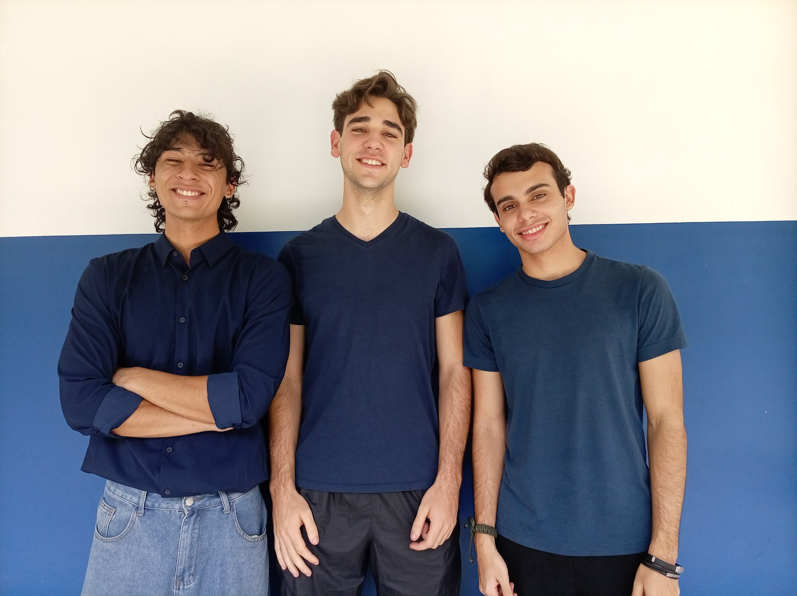

# Neutrinos Electrónicos WRO 2026 - Terreneitor

## Table of Contents

- [Project Overview](#project-overview)
- [Team Introduction](#team-introduction)
- [System Architecture](#system-architecture)
- [Hardware Specifications](#hardware-specifications)
- [Software Architecture](#software-architecture)
- [Algorithmic Logic](#algorithmic-logic)
  - [Finite State Machine (FSM)](#finite-state-machine-fsm)
  - [PID Control System](#pid-control-system)
  - [Computer Vision Processing](#computer-vision-processing)
  - [LiDAR-Based Parking](#lidar-based-parking)
  - [Serial Communication Protocol](#serial-communication-protocol)
- [Module Descriptions](#module-descriptions)
- [WRO 2026 Compliance](#wro-2026-compliance)
- [Installation and Setup](#installation-and-setup)
- [Configuration](#configuration)
- [Usage Instructions](#usage-instructions)

## Project Overview

Terreneitor is an autonomous robot designed for the World Robot Olympiad (WRO) 2026 competition. The robot implements a hybrid architecture combining a Raspberry Pi 4 as the high-level processing unit and an Arduino UNO as the real-time hardware controller. This design ensures both sophisticated decision-making capabilities and precise motor control with minimal latency.

**Key Design Principles:**
- **Hybrid Centralized Architecture:** Single Raspberry Pi 4 as master node with Arduino UNO as dedicated hardware controller to avoid critical latency issues
- **Isolated Control Loop:** PID-based motor control with encoder feedback running entirely on Arduino for immediate, smooth velocity control without network delays
- **Configuration-Driven Logic:** All competition logic decoupled from source code via centralized config.yaml for rapid pit modifications without recompilation
- **Modular Software Design:** Event-based Finite State Machine (FSM) on Raspberry Pi enabling independent development, testing, and debugging of each race phase

## Team Introduction



| Name | Role |
|------|------|
| Ismael Armada | Programmer |
| Sebastián Vera | Mechanical Engineer |
| Andrés Lugo | Electrical Engineer |

**Ismael Armada:** 20 years old, 4th semester Computer Science student. Discovered WRO through a mutual friend with our team coach. This competition represents my first major challenge in robotics engineering, pushing my programming skills to new heights in a real-world engineering project.

**Sebastián Vera:** 18 years old, 2nd-3rd semester Mechanical Engineering student. First encountered WRO in high school when representing my school. That experience sparked my passion for robotics, and I hope to represent both my team and country in this incredible competition.

**Andrés Lugo:** 19 years old, 2nd semester Electrical Engineering student. Discovered WRO through competing with Sebastián in high school. With limited initial knowledge, this was my entry into the robotics world, where I hope to have the honor of representing my country.

## System Architecture

The system employs a dual-processor architecture optimized for both high-level decision making and real-time hardware control:

**Raspberry Pi 4 (High-Level Processing):**
- Processes camera input using OpenCV for color detection
- Manages LiDAR sensor data for parking maneuvers
- Implements Finite State Machine for race phase management
- Executes navigation strategies and obstacle avoidance algorithms
- Handles competition rule compliance (time limits, lap counting, signal violation detection)

**Arduino UNO (Real-Time Control):**
- Receives velocity and steering commands via serial communication
- Implements PID control loop for motor speed regulation
- Reads encoder data for velocity feedback and distance measurement
- Controls motor driver (BTS7960 H-bridge) and steering servo (MG996R)
- Sends telemetry data back to Raspberry Pi

**Communication Protocol:**
- Serial USB connection at 115200 baud
- Command format: `V:[velocity];A:[angle]\n`
- Telemetry format: `T:RPM:[rpm];CMS:[speed];DIST:[distance];A:[angle]\n`
- Asynchronous command queue with dedicated worker thread for non-blocking operation

## Hardware Specifications

### Main Components
- **SBC:** Raspberry Pi 4 Model B - 4GB RAM
- **MCU:** Arduino UNO

### Power Architecture
- Motor battery pack
- Separate batteries for Arduino and Raspberry Pi
- Voltage stabilizer: XL4015 model
- Battery charger
- Battery mounting structure
- Two switches: main power and start button
- 5V cooling fan for Raspberry Pi 4

### Sensors
- **Camera:** OV5647 with 120° field of view
- **Distance Sensors:** HC-SR04 ultrasonic sensors
- **Orientation Sensor:** MPU6050 6-DOF IMU
- **LiDAR:** TF-Luna mounted on SG90 servo
- **Speed Sensor:** 100-line quadrature encoder (phase-shifted)
  - Generates quadrature signals for velocity measurement and direction detection

### Actuators
- **Motor Driver:** BTS7960 H-bridge
- **Traction Motor:** DC motor
- **Steering Servo:** MG996R 180° servo motor

### Other Components
- Cables and USB cables
- Soldering materials
- 3D printed parts

## Software Architecture

### Programming Languages
- **Python:** Raspberry Pi high-level processing
- **C++:** Arduino real-time control

### Python Libraries
- **PyYAML:** Configuration file parsing
- **OpenCV:** Computer vision processing
- **PySerial:** Serial communication with Arduino
- **GPIOZero:** GPIO pin control for buttons and servos
- **NumPy:** Numerical operations for vision processing

### Directory Structure

```
WRO2026-neutrinos-electronicos/
│
├── README.md                         # Main project documentation
├── .gitignore                        # Binary/temporary file exclusions
│
├── docs/                             # Hardware resource repository
│   ├── diagramas_electricos/         # Power and sensor schematics (for Andrés)
│   ├── modelos_3d/                   # STL parts and chassis (for Sebastián)
│   └── misc/                         # Team photos, robot images, etc.
│
├── arduino/                          # C++ source code (Arduino IDE)
│   └── firmware_terreneitor/
│       ├── firmware_terreneitor.ino   # Main loop (Setup and Loop)
│       ├── config.h                   # Static pin assignments and interrupts
│       ├── motores.cpp               # H-bridge control, MG996R servo, PID speed control
│       ├── sensores.cpp              # Encoder, HC-SR04, MPU6050 routines
│       ├── comunicacion.cpp          # Serial messaging protocol parsers
│       ├── pid.cpp                   # PID controller with anti-windup
│       └── pid.h                     # PID structure and function declarations
│
└── raspberry_pi/                     # Python source code (Main Processing)
    ├── requirements.txt              # Required libraries (opencv-python, pyyaml, pyserial, gpiozero)
    ├── main.py                      # Startup script and system orchestration
    ├── config.yaml                  # Calibration parameters and competition variables
    ├── src/                         # Control modules and libraries
    │   ├── __init__.py
    │   ├── config_loader.py         # YAML file validator and reader
    │   ├── comms_arduino.py         # Serial communication interface
    │   ├── vision.py                # HSV segmentation algorithms (120° Camera)
    │   └── lidar.py                 # SG90 servo control and TF-Luna readings
    │
    ├── estados/                     # Independent FSM state classes
    │   ├── __init__.py
    │   ├── fsm.py                   # Native transition controller
    │   ├── estado_inicio.py         # Initialization and condition checking routine
    │   ├── estado_navegacion.py     # Obstacle avoidance algorithm (Red/Green)
    │   ├── estado_estacionar.py     # Automatic parallel parking maneuver
    │   └── estado_fin.py            # Safe vehicle shutdown at round end
    │
    └── estrategias/                 # Interchangeable strategies for surprise rules
        ├── __init__.py
        ├── estrategia_base.py       # Abstract base class for strategies
        └── estrategia_normal.py     # Normal navigation strategy
```

## Algorithmic Logic

### Finite State Machine (FSM)

The robot's behavior is controlled by an event-based Finite State Machine implemented in Python on the Raspberry Pi. The FSM manages the complete race cycle through distinct states:

**State: INICIO (Start)**
- Waits for physical start button press via GPIO
- Initializes all hardware interfaces (camera, LiDAR, Arduino communication)
- Loads competition configuration from config.yaml
- Falls back to keyboard input if GPIO unavailable (degraded mode)
- Transitions to NAVEGACION upon button press

**State: NAVEGACION (Navigation)**
- Main navigation state for both Obstacle and Open challenges
- Implements lap counting using encoder telemetry
- Enforces 3-minute time limit
- Detects finish section for Open Challenge
- Detects signal violations for Obstacle Challenge
- Returns to start section after 3 laps in Open Challenge
- Uses asynchronous vision processing for obstacle detection
- Transitions to ESTACIONAR (Obstacle) or FIN (Open) based on challenge type

**State: ESTACIONAR (Parking)**
- Executes automatic parallel parking maneuver using LiDAR
- Multi-phase parking algorithm:
  1. **Scan Phase:** Sweeps LiDAR servo to detect parking gap
  2. **Approach Phase:** Moves forward and aligns with detected gap
  3. **Reverse Phase:** Executes reverse maneuver into parking space
  4. **Straighten Phase:** Adjusts final position within parking space
- Uses TF-Luna distance sensor for gap detection
- Transitions to FIN upon completion

**State: FIN (Finish)**
- Stops all motors immediately
- Centers steering servo
- Signals FSM exit
- Ensures safe shutdown of all hardware

### PID Control System

The Arduino implements a PID controller for precise motor speed regulation:

**PID Algorithm:**
```
error = setpoint - measured_value
integral = integral + error * dt
derivative = (error - previous_error) / dt
output = Kp * error + Ki * integral + Kd * derivative
```

**Anti-Windup Protection:**
- Clamps integral term when output saturates
- Prevents integral windup during prolonged error conditions
- Ensures stable control during startup and direction changes

**Encoder-Based Velocity Feedback:**
- 100-line quadrature encoder provides 400 pulses per revolution
- Interrupt-driven reading ensures accurate velocity measurement
- Velocity calculated in cm/s based on wheel circumference
- Distance accumulated for lap counting

**Control Loop Frequency:**
- PID computation at 50 Hz (every 20ms)
- Telemetry transmission at 10 Hz (every 100ms)
- Watchdog timeout stops motors if no commands received within 500ms

### Computer Vision Processing

The vision system uses OpenCV for real-time color detection and obstacle avoidance:

**HSV Color Space Segmentation:**
- Converts RGB camera frames to HSV color space
- Defines color ranges for Red, Green, and Magenta (parking zone)
- Red uses dual-range detection (0-10° and 170-180° in hue)
- Green: 40-80° hue range
- Magenta: 140-170° hue range

**Noise Filtering:**
- Morphological opening operation with 5x5 kernel
- Removes small noise and fills small holes
- Ensures robust detection under varying lighting conditions

**Contour Analysis:**
- Finds contours in masked color regions
- Selects largest contour by area
- Calculates centroid using image moments
- Filters detections by minimum area threshold (configurable)

**Asynchronous Processing:**
- Vision processing runs in background thread
- Main loop retrieves latest detection without blocking
- Enables ~20 Hz control loop while vision processes at ~10 Hz
- Prevents camera read delays from affecting motor control

**Proportional Steering:**
- Calculates steering angle based on obstacle centroid position
- Obstacles closer to frame center require sharper turns
- Formula: `angle = straight + factor * (evasion_angle - straight)`
- Factor ranges from 0 (edge) to 1 (center) for smooth steering

### LiDAR-Based Parking

The parking system uses the TF-Luna LiDAR sensor mounted on a servo for gap detection and maneuver execution:

**Servo Scanning:**
- SG90 servo sweeps LiDAR from 45° to 135°
- Step size configurable (default 15°)
- Sleep time reduced to 80ms for performance optimization
- Returns list of (angle, distance) tuples

**Gap Detection Algorithm:**
- Searches for 3 consecutive readings above threshold (80cm)
- Indicates open space suitable for parking
- Logs detected gap angle for alignment

**Parking Maneuver Phases:**

1. **Scan Phase:**
   - Stops robot for stable scanning
   - Sweeps LiDAR across angle range
   - Identifies parking gap location
   - Retries up to 5 times if no gap found

2. **Approach Phase:**
   - Moves forward slowly for 1.5 seconds
   - Turns steering to align with gap
   - Stops momentarily before reverse

3. **Reverse Phase:**
   - Turns wheels at angle for reverse entry
   - Reverses for 1.2 seconds
   - Straightens wheels and continues reverse
   - Turns opposite direction to straighten
   - Checks distance to wall with LiDAR
   - Adjusts position if too close

4. **Straighten Phase:**
   - Moves forward slightly to center
   - Stops completely
   - Marks parking as complete

**Error Handling:**
- All LiDAR operations wrapped in try-except blocks
- Returns -1.0 on read errors for graceful degradation
- Logs errors for diagnostic purposes

### Serial Communication Protocol

The communication between Raspberry Pi and Arduino uses a custom serial protocol:

**Command Format (Pi → Arduino):**
```
V:[velocity];A:[angle]\n
```
- Velocity: 0-100 (percentage of max speed)
- Angle: 40-140 (servo angle, 90 = straight)
- Example: `V:60;A:90\n` (60% speed, straight)

**Telemetry Format (Arduino → Pi):**
```
T:RPM:[rpm];CMS:[speed];DIST:[distance];A:[angle]\n
```
- RPM: Motor revolutions per minute (0-5000)
- CMS: Speed in cm/s (0-200)
- DIST: Accumulated distance in cm (0-100000)
- Angle: Current servo angle (40-140)
- Example: `T:RPM:1200;CMS:45;DIST:1234;A:90\n`

**Asynchronous Command Queue:**
- Commands placed in queue (max 10 items)
- Dedicated worker thread processes queue
- Non-blocking send from main loop
- Discards oldest command if queue full (acceptable for real-time control)
- Timeout of 50ms on queue get to prevent blocking

**Telemetry Validation:**
- Range validation on all received values
- Rejects values outside expected ranges
- Prevents corrupted data from affecting control
- Logs validation failures for debugging

**Reconnection Logic:**
- Automatic reconnection attempt on serial errors
- Separate thread for reconnection to avoid blocking
- 2-second backoff between attempts
- Graceful degradation if reconnection fails

## Module Descriptions

### Arduino Firmware Modules

**firmware_terreneitor.ino**
- Main entry point for Arduino firmware
- Initializes serial communication at 115200 baud
- Sets up encoder interrupts
- Initializes motor driver and servo
- Main loop processes serial commands and runs PID control
- Sends telemetry every 100ms
- Implements watchdog timeout (500ms) for safety

**config.h**
- Defines pin assignments for all hardware
- Declares global variables shared across modules
- Defines physical constants (wheel circumference, etc.)
- Specifies PID parameters (Kp, Ki, Kd)
- Defines function prototypes for all modules

**motores.cpp**
- Controls BTS7960 H-bridge motor driver
- Controls MG996R steering servo
- Implements PID control loop
- Applies velocity and angle commands
- Constrains angles to safe range (40-140)
- Currently supports forward motion only

**sensores.cpp**
- Handles encoder interrupt service routines
- Counts encoder ticks for velocity calculation
- Calculates speed in cm/s based on wheel circumference
- Accumulates total distance traveled
- Uses atomic operations for safe interrupt reading

**comunicacion.cpp**
- Initializes serial communication
- Reads incoming commands line-by-line
- Parses command format: `V:[vel];A:[ang]\n`
- Updates velocity and angle setpoints
- Validates command format
- Discards invalid commands

**pid.cpp**
- Implements PID controller structure
- Provides initialization function
- Computes PID output from error
- Implements anti-windup clamping
- Provides reset function for integral/derivative

**pid.h**
- Declares PID structure with Kp, Ki, Kd, integral, derivative
- Declares function prototypes
- Defines constants for anti-windup

### Raspberry Pi Software Modules

**main.py**
- Entry point for Raspberry Pi software
- Loads configuration from config.yaml
- Initializes hardware interfaces (Arduino, vision, LiDAR)
- Loads navigation strategy (for surprise rules)
- Sets up FSM with all states
- Runs FSM main loop
- Handles graceful shutdown and resource cleanup

**config_loader.py**
- Reads and parses YAML configuration file
- Validates configuration ranges (speeds, angles)
- Provides accessor methods for config sections
- Returns default values if config missing
- Validates competition parameters

**comms_arduino.py**
- Manages serial connection with Arduino
- Implements asynchronous command queue
- Dedicated worker thread for command sending
- Non-blocking command sending from main loop
- Reads and parses telemetry with validation
- Implements automatic reconnection on errors
- Provides safe shutdown method

**vision.py**
- Processes camera frames for color detection
- Implements HSV color segmentation
- Filters noise with morphological operations
- Calculates contours and centroids
- Implements asynchronous processing with background thread
- Provides latest detection without blocking
- Supports Red, Green, and Magenta detection

**lidar.py**
- Interfaces with TF-Luna LiDAR sensor
- Controls SG90 servo for scanning
- Parses 9-byte TF-Luna data frames
- Validates signal strength for reliable readings
- Implements environment scanning with servo sweep
- Optimized scan time (80ms per step)
- Provides distance reading in centimeters

**fsm.py**
- Base class for FSM states
- FSM manager class for state transitions
- Handles state registration
- Runs FSM main loop
- Manages state enter/execute/exit lifecycle
- Supports graceful FSM exit

**estado_inicio.py**
- Waits for physical start button press
- Uses gpiozero.Button for GPIO control
- Falls back to keyboard input if GPIO unavailable
- Initializes all hardware on entry
- Releases button resources on exit

**estado_navegacion.py**
- Main navigation state for both challenges
- Implements lap counting with encoder
- Enforces 3-minute time limit
- Detects finish section for Open Challenge
- Detects signal violations for Obstacle Challenge
- Returns to start section after 3 laps
- Uses asynchronous vision processing
- Implements proportional steering for obstacle avoidance
- Handles both Obstacle and Open challenge logic

**estado_estacionar.py**
- Executes automatic parallel parking
- Multi-phase parking algorithm
- Uses LiDAR for gap detection
- Implements scan, approach, reverse, and straighten phases
- Comprehensive error handling for all hardware operations
- Transitions to FIN upon completion

**estado_fin.py**
- Stops all motors immediately
- Centers steering servo
- Signals FSM exit
- Ensures safe shutdown

**estrategia_base.py**
- Abstract base class for navigation strategies
- Defines interface for strategy implementation
- Enables strategy injection for surprise rules
- Requires decidir_accion() and get_nombre() methods

**estrategia_normal.py**
- Concrete implementation of normal navigation strategy
- Implements obstacle avoidance logic
- Red: evade to left (angle 130)
- Green: evade to right (angle 50)
- Magenta: straight line (parking zone)
- Proportional steering based on obstacle position

## Competition Challenges

1. **Electrical and Chassis Phase (Andrés and Sebastián):** Assembly of battery structure with XL4015 regulator to ensure clean and independent power supply for Raspberry Pi and Arduino. Wiring of BTS7960 H-bridge and main motor mounting.
2. **Traction Control Loop (Ismael):** Arduino programming of DC motor speed control in closed loop using encoder interrupts. The goal of this milestone is to achieve constant robot speed in cm/s regardless of battery charge state.
3. **Vision and Link Prototyping (Ismael):** Development of vision.py script on Raspberry Pi using static images of color blocks (red/green) to define optimal HSV ranges. In parallel, establish basic serial communication to send simple text frames like V:50;A:90 (Velocity: 50%, Angle: 90°) to Arduino.
